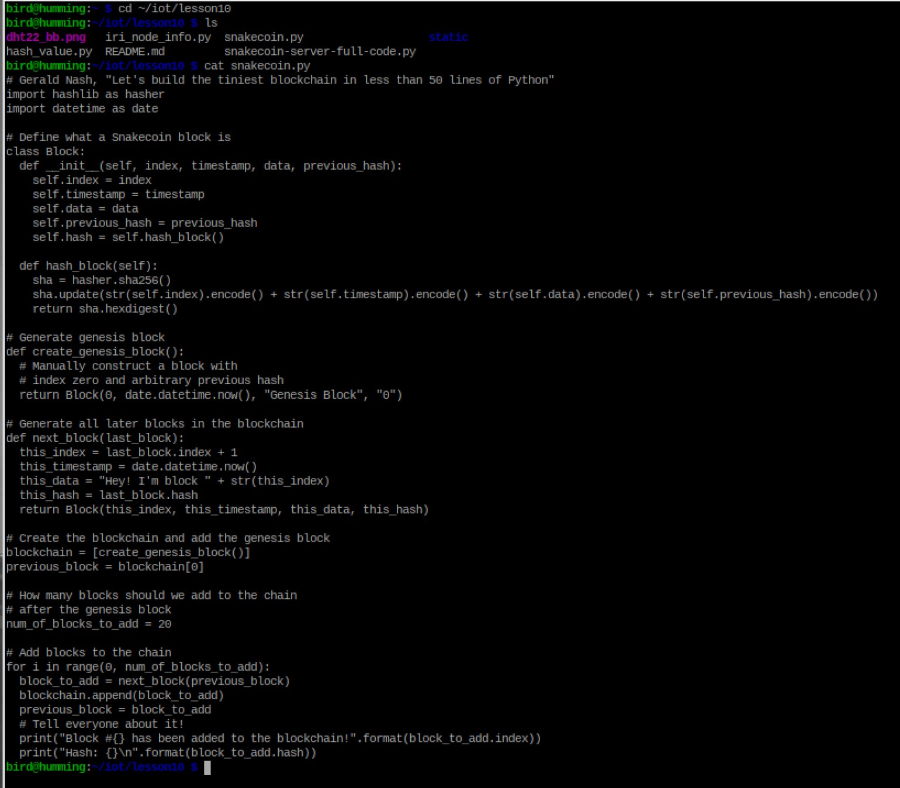
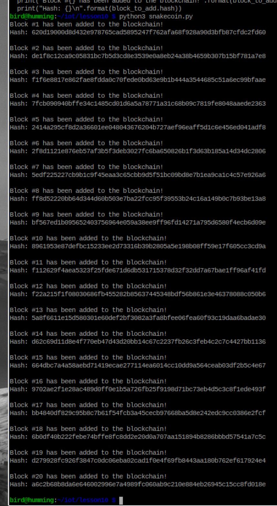
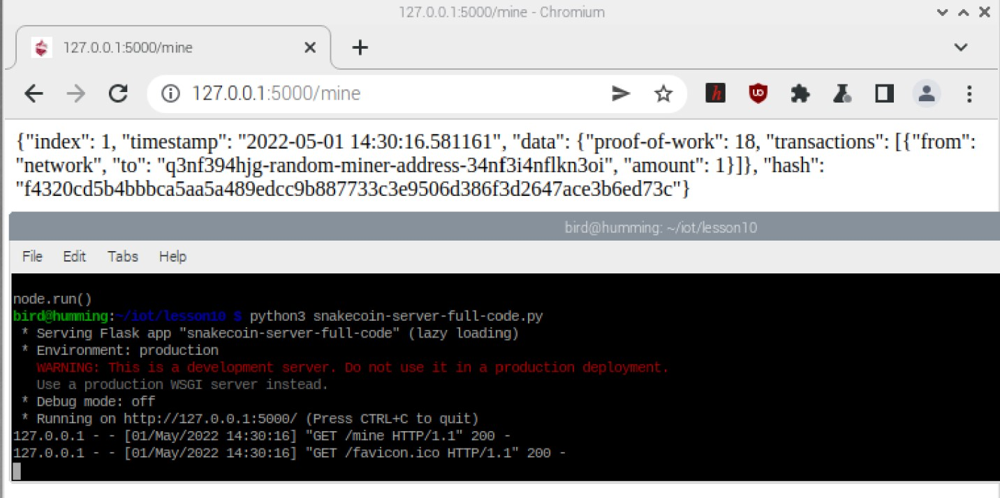
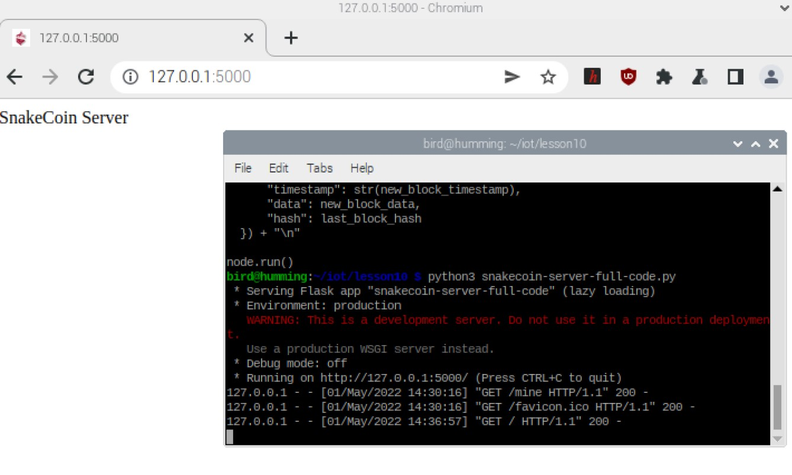
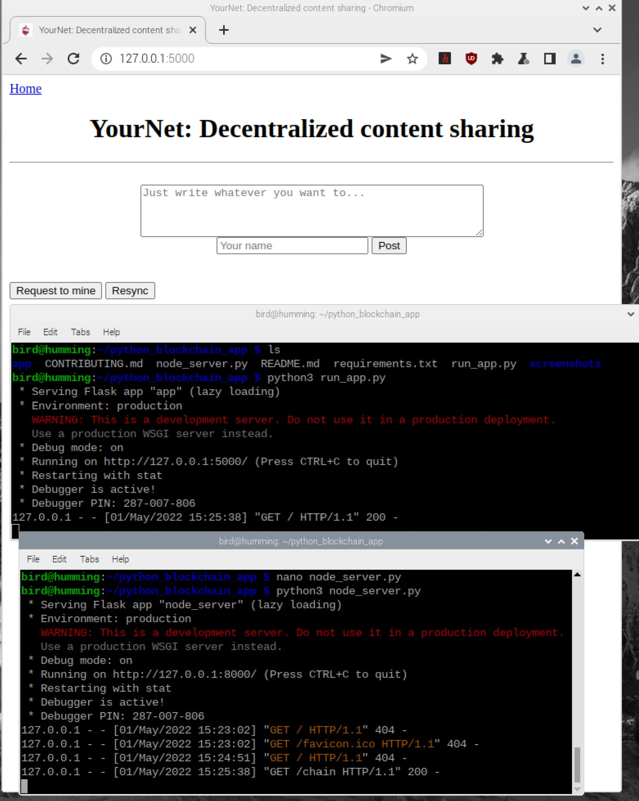
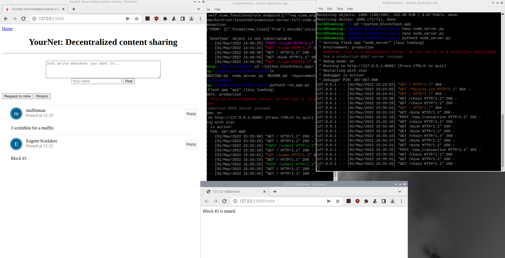

# Lab 10A: Blockchain

## `cat hash_value.py`  
  

## `python hash_value.py`, run twice.  
  

## SHA-2 Secure Hash Algorithm  
  

## `cat snakecoin.py`  
  

## running `snakecoin.py`  
  

## running `snakecoin-full-server-code.py`  
  
  

## Creating a transaction + mining a new block
After attempting to create a transaction, I got a few errors pictured below. I am not sure if this means everything is functioning correctly or otherwise.  
 

# Swatik Kansal's Python Blockchain App

## Specifying port number in `node_server.py`  
  

## Running the server for the app  
  

## Performing a few transactions  
  
