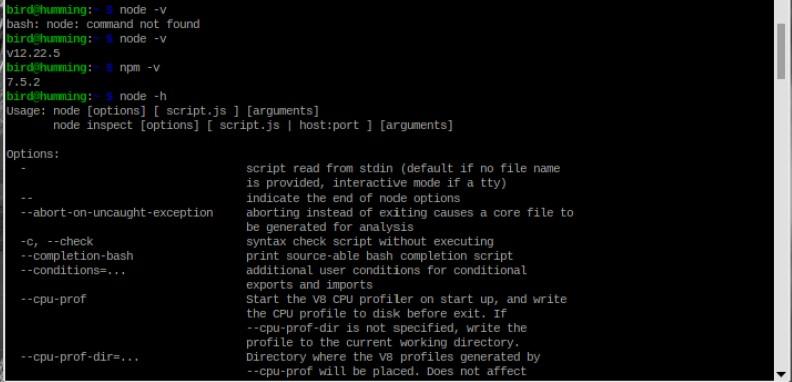
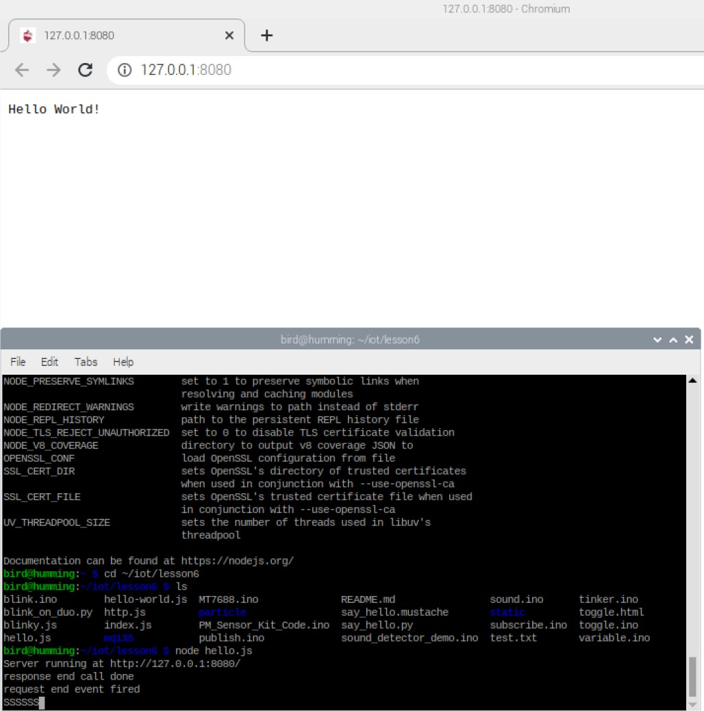
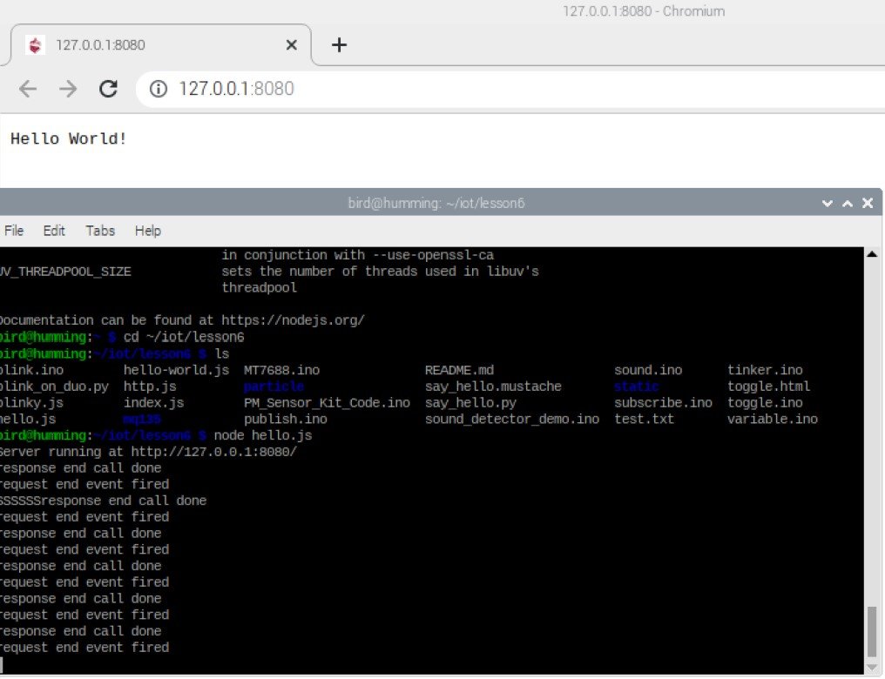
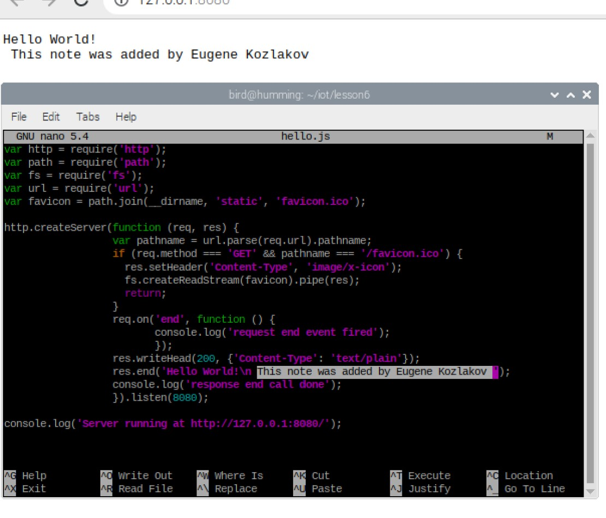
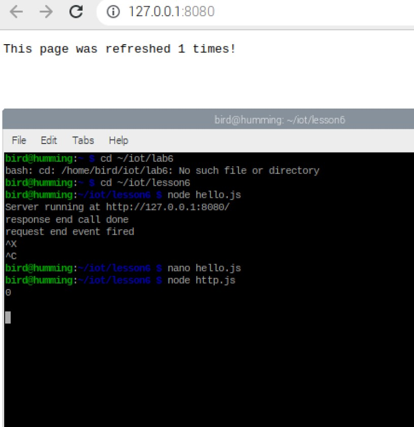
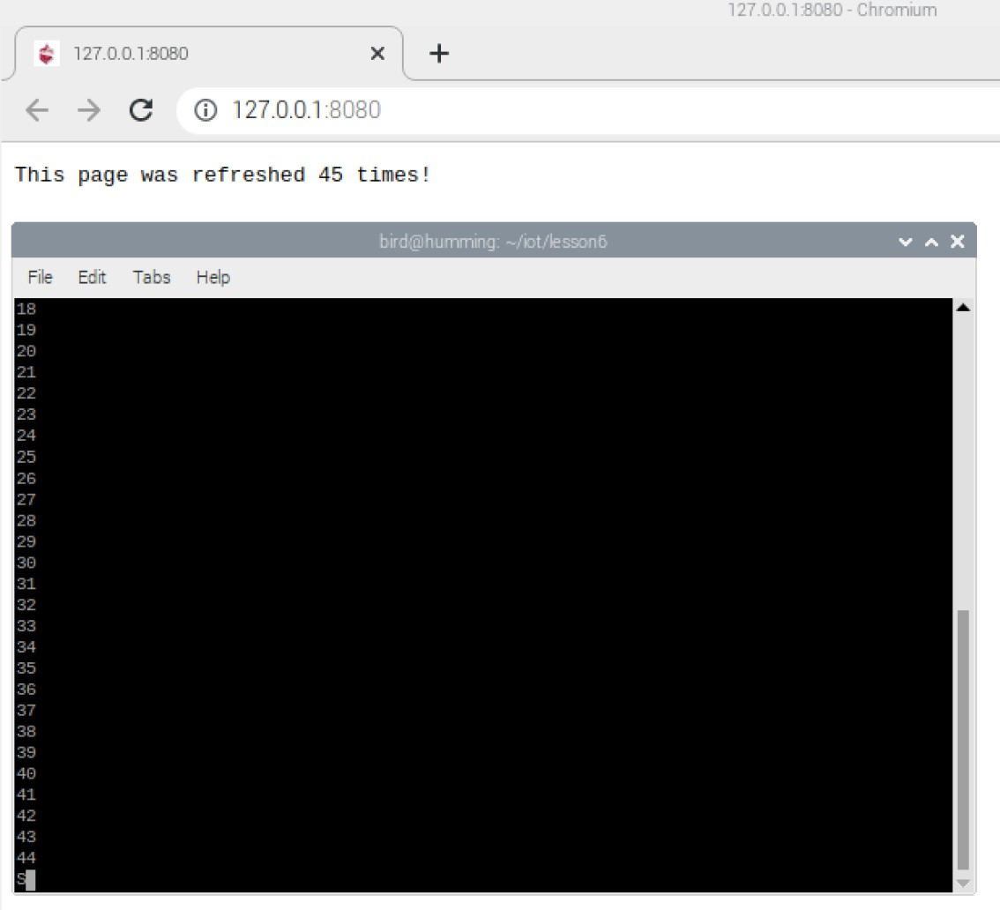
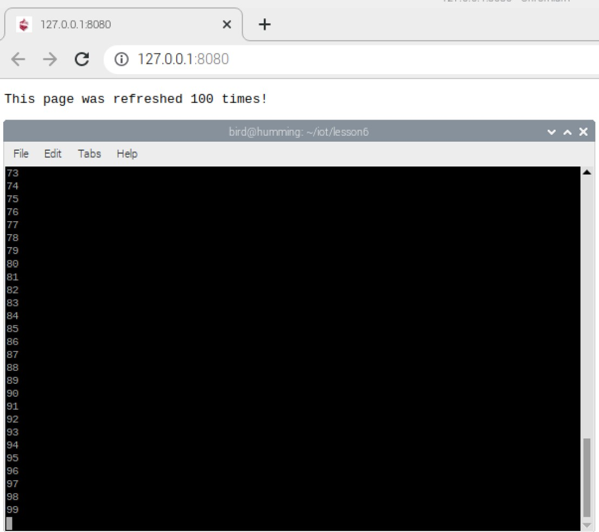

# Lab 6: Node.js  

In this lab, I'll be running a Node.js server on my raspberry-pi via Node-RED on my terminal.  
I'll be using the "Bullseye" version of the Raspberry Pi OS, which at the time of writing is the latest release.    

## Installation, Version Check, etc. 

  

## Launching 'hello.js'  

## After hitting "refresh" on the page multiple times  
  

## Making edits to 'hello.js' file  

### Edits in 'hello.js' file 
  

### Running 'hello.js' file with edits 
 

## Running 'http.js' file  
### First refresh  
  

### Running up the counter!  
  

### 100th Refresh! 
 

