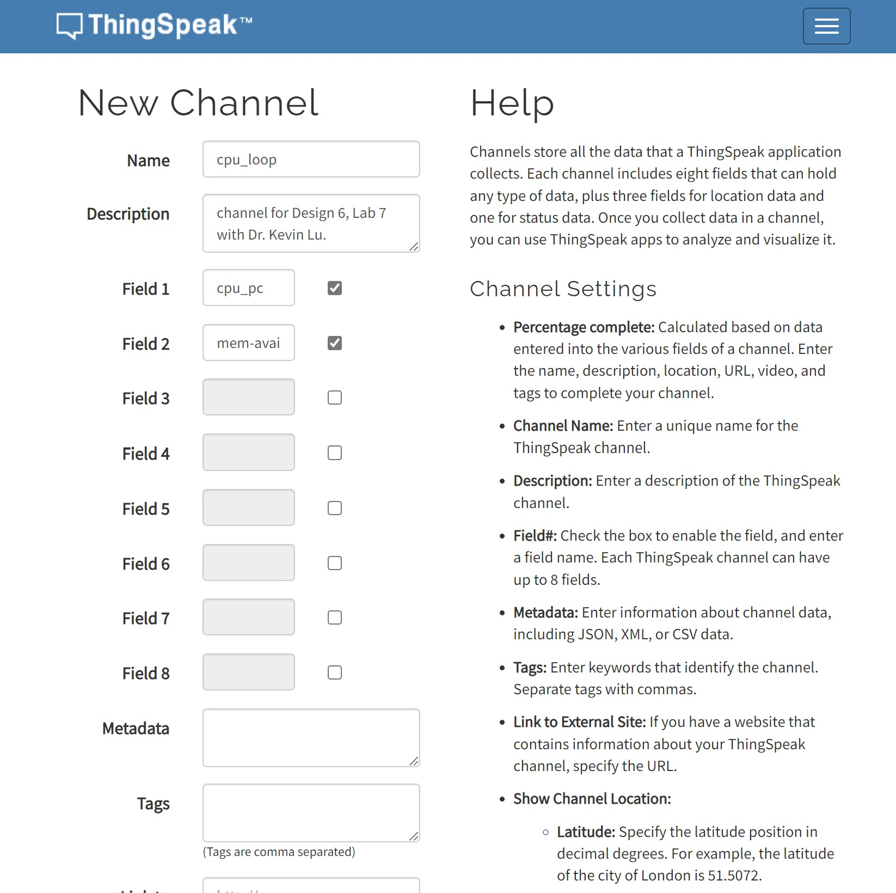

# Lab 7A: ThingSpeak  
 In this lab we will be writing CPU data and available memory 
## Making Channel  
  

## `cat thingspeak_cpu_loop.py`
  

## `cat thingspeak_feed.py`  
  

## `python3 thingspeak_feed.py`  
```
bird@humming:~/CPE322A-D6/Lab7/demo $ python3 thingspeak_feed.py
An API key savefile was not found. Enter Write API Key >>> [REDACTED]
Should we save this key for future use? [y/N] >>> n
1.0
3386.48828125
Sat, 30 Apr 2022 18:25:01
200 OK
0.3
3390.3125
Sat, 30 Apr 2022 18:26:01
200 OK
1.3
3390.2890625
Sat, 30 Apr 2022 18:27:01
200 OK

...
```  

## Results after ~1 hour
### 'cpu_loop' 
  

### 'mem_avail_mb'  
  
