# Lab 8A: Data Analysis Examples

After following the instructions for [installing TensorFlow on Debian Bullseye](https://blog.d-and-j.net/deep-learning/2021/03/24/tensorflow-debian-11.html) as best as I could, I began following some of the example code for this lab.

## Numpy Array Examples

```
bird@humming:~ $ python3
Python 3.9.2 (default, Mar 12 2021, 04:06:34) 
[GCC 10.2.1 20210110] on linux
Type "help", "copyright", "credits" or "license" for more information.
>>> import numpy as np
>>> a = np.range(6)
>>> a = np.arange(6)
>>> a
array([0, 1, 2, 3, 4, 5])
```  

```
>>> b = np.arange(12).reshape(4, 3)
>>> b
array([[ 0,  1,  2],
       [ 3,  4,  5],
       [ 6,  7,  8],
       [ 9, 10, 11]])

```  

```
>>> c = np.arange(24).reshape(2, 3, 4)
>>> c
array([[[ 0,  1,  2,  3],
        [ 4,  5,  6,  7],
        [ 8,  9, 10, 11]],

       [[12, 13, 14, 15],
        [16, 17, 18, 19],
        [20, 21, 22, 23]]])

```  
```
>>> b.shape
(4, 3)
>>> b.reshape(-1)
array([ 0,  1,  2,  3,  4,  5,  6,  7,  8,  9, 10, 11])
>>> b.rehsape(-1,1)
>>> b.reshape(-1,1)
array([[ 0],
       [ 1],
       [ 2],
       [ 3],
       [ 4],
       [ 5],
       [ 6],
       [ 7],
       [ 8],
       [ 9],
       [10],
       [11]])
>>> b.reshape(2, -1)
array([[ 0,  1,  2,  3,  4,  5],
       [ 6,  7,  8,  9, 10, 11]])
```  
```
>>> d = np.array([20, 30, 40, 50])
>>> d
array([20, 30, 40, 50])
>>> e = np.arange(4)
>>> e
array([0, 1, 2, 3])
>>> f = d-e
>>> f
array([20, 29, 38, 47])
>>> e**2
array([0, 1, 4, 9], dtype=int32)
```  
```
>>> A = np.array([[1, 1], [0,1]])
>>> B = np.array([[2,0], [3,4]])
>>> A
array([[1, 1],
       [0, 1]])
>>> B
array([[2, 0],
       [3, 4]])
>>> A*B
array([[2, 0],
       [0, 4]])
>>> A.dot(B)
array([[5, 4],
       [3, 4]])
>>> np.dot(A,B)
array([[5, 4],
       [3, 4]])
```    
```
>>> g = np.ones((2,3), dtype=int)
>>> g
array([[1, 1, 1],
       [1, 1, 1]])
>>> h = np.random.random((2, 3))
>>> h
array([[0.70808437, 0.08466636, 0.28659055],
       [0.5200572 , 0.74046818, 0.23931682]])
>>> g *= 3
>>> g
array([[3, 3, 3],
       [3, 3, 3]])
>>> h += g
>>> h
array([[3.70808437, 3.08466636, 3.28659055],
       [3.5200572 , 3.74046818, 3.23931682]])
```  
```
>>> k = np.random.random((2,3))
>>> k
array([[0.62038486, 0.0447532 , 0.16935452],
       [0.67369966, 0.16229027, 0.66676298]])
>>> k.sum()
2.3372454889248333
>>> k.min()
0.044753203639362416
>>> k.max()
0.6736996629093664
```  
```
>>> m = np.arange(12).reshape(3, 4)
>>> m
array([[ 0,  1,  2,  3],
       [ 4,  5,  6,  7],
       [ 8,  9, 10, 11]])
>>> m.sum(axis = 0)
array([12, 15, 18, 21])
>>> m.min(axis = 1)
array([0, 4, 8])
>>> m.cumsum(axis = 1)
array([[ 0,  1,  3,  6],
       [ 4,  9, 15, 22],
       [ 8, 17, 27, 38]], dtype=int32)
```  
```
>>> n = np.arange(5)
>>> n
array([0, 1, 2, 3, 4])
>>> n[[1, 3, 4]] = 0
>>> n
array([0, 0, 2, 0, 0])
```  

## Running Basic Python Plots  
### `pyplot_simple.py `  
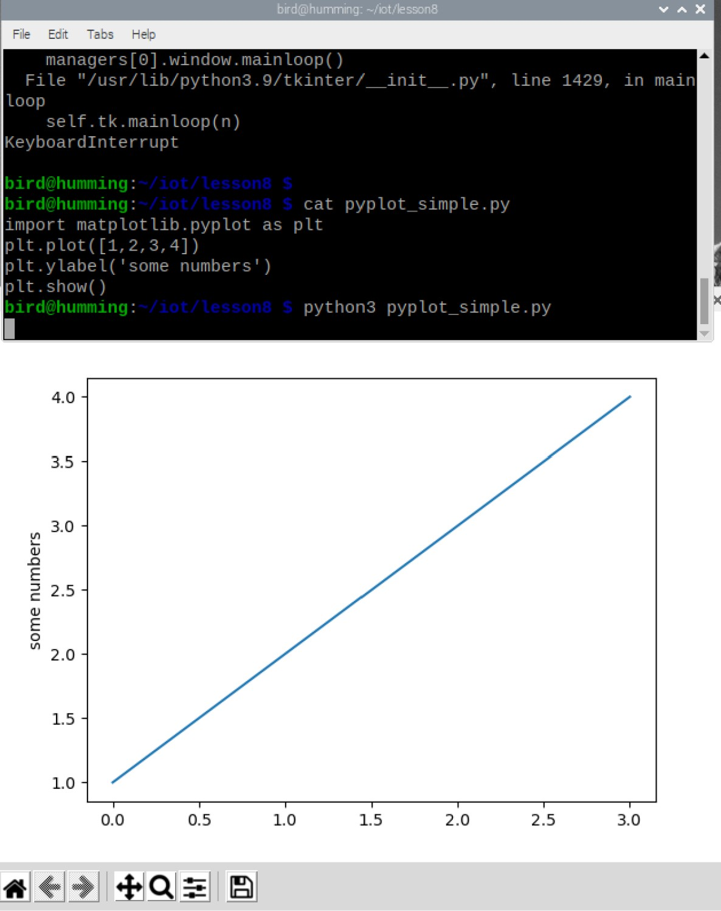  
### `simple_plot.py`  
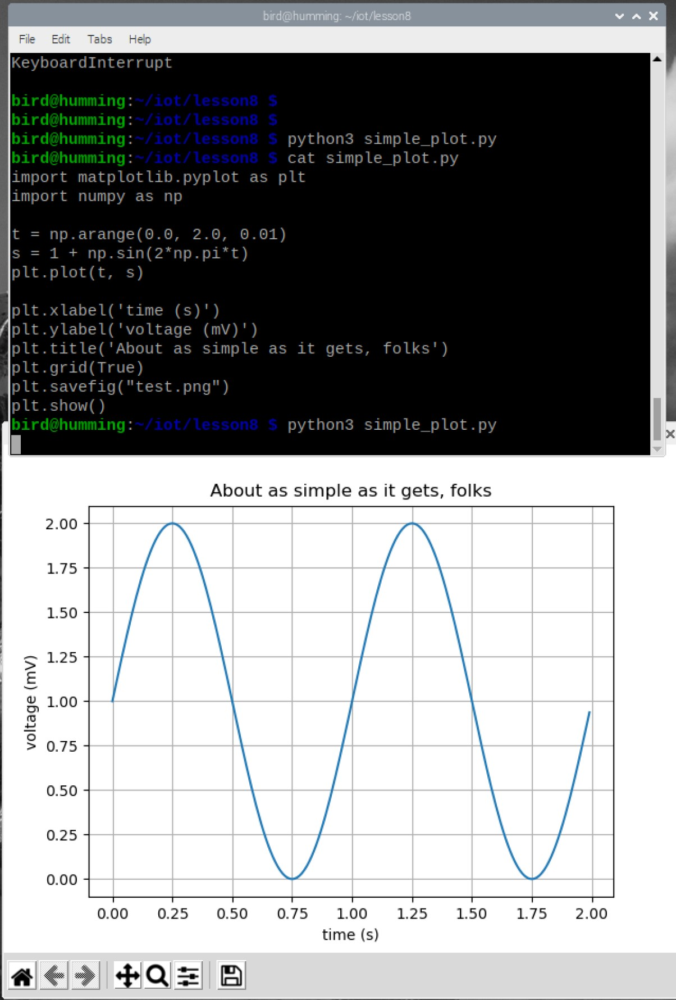  
### `pyplot_formatstr.py`  
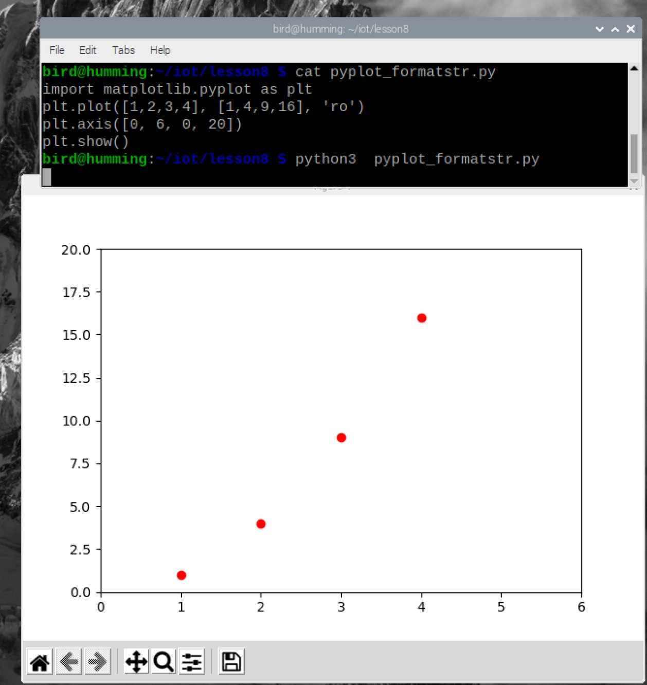 
### `ticklabels_demo_rotation.py`  
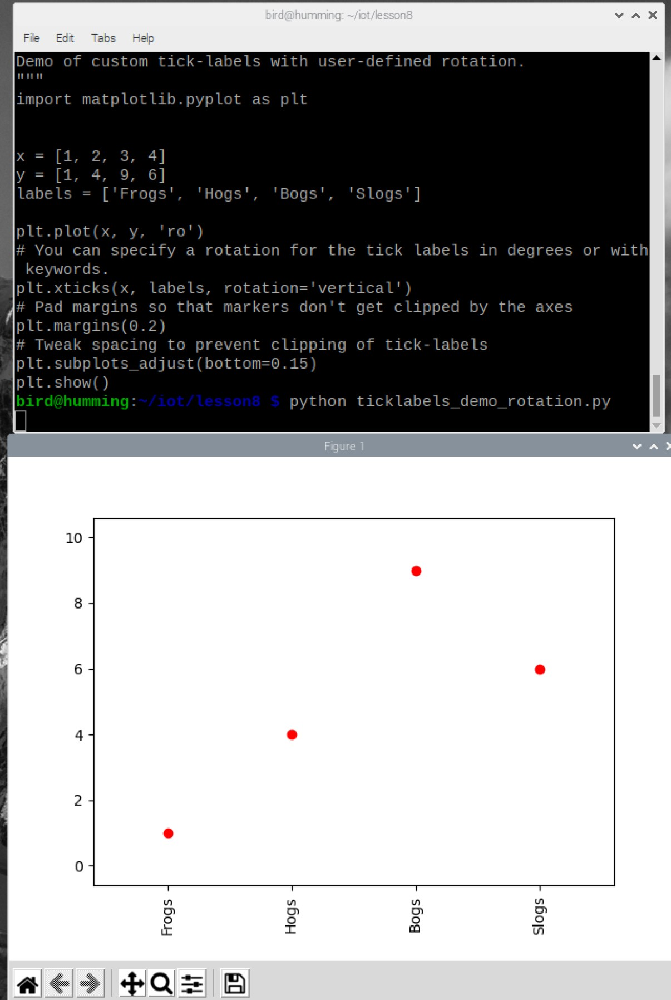  
### `pyplot_three.py`    
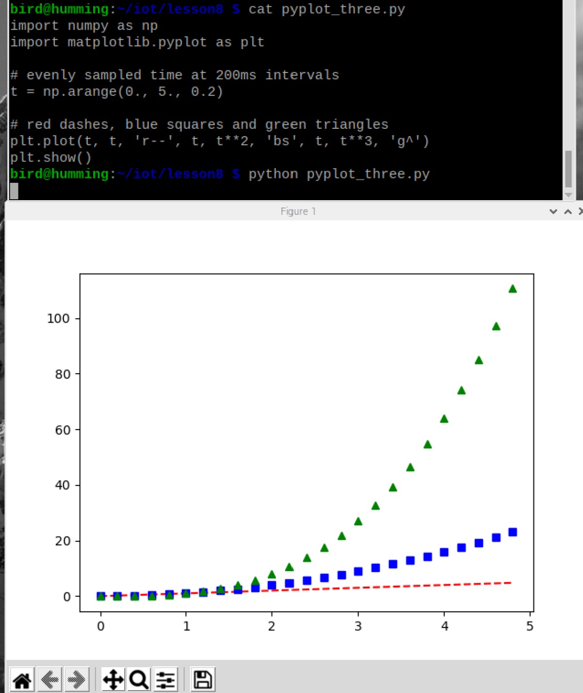
### `pyplot_two_subplots.py`    
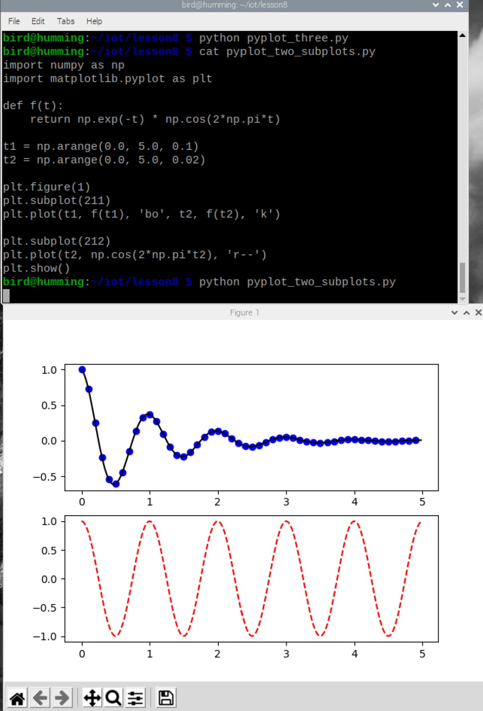
### `pyplot_scales.py`    
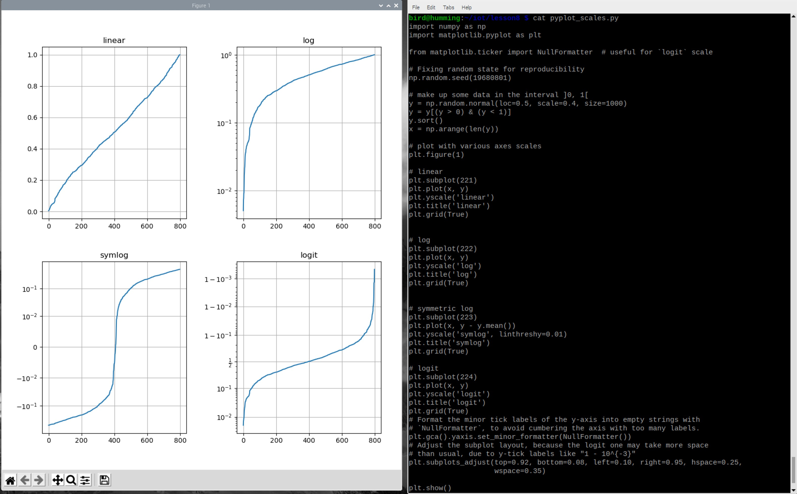
### `pyplot_annotate.py`    
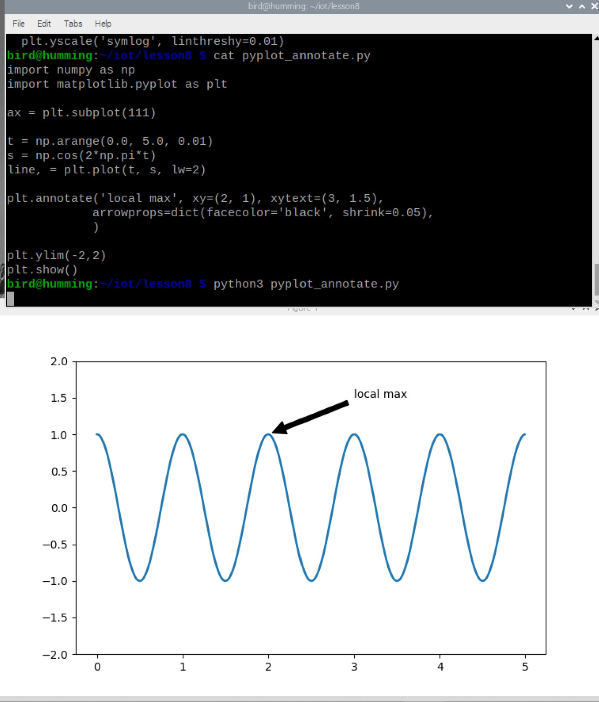  
### `major_minor_demo1.py`    
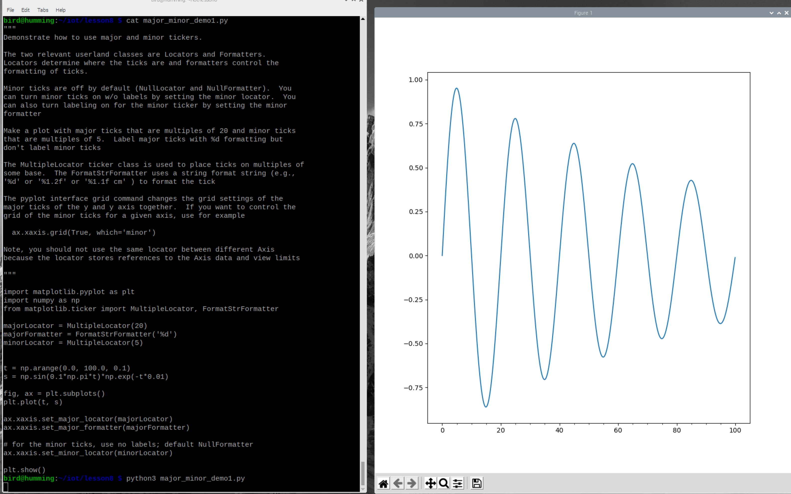  
### `legend_demo.py`    
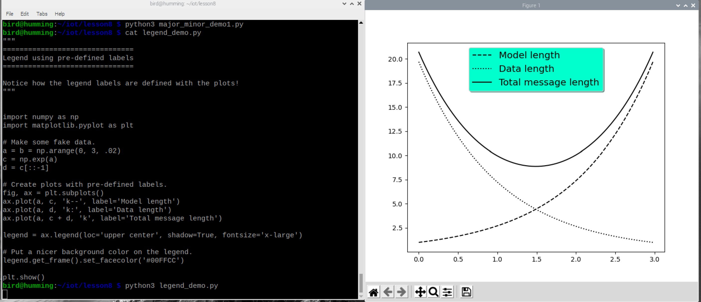  

## Histogram, box plots, regression, and interpolation
### `plot_lda.py` 
`cat details`, then plot.  
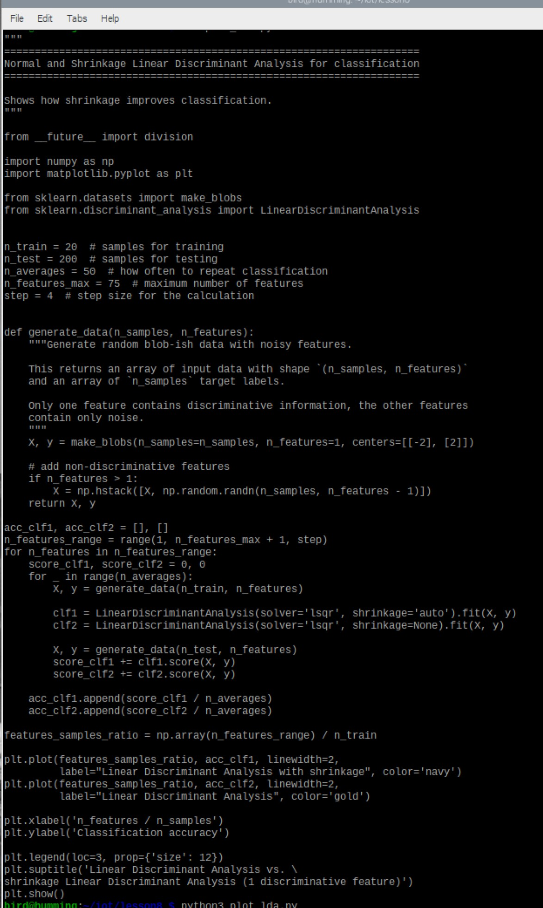  
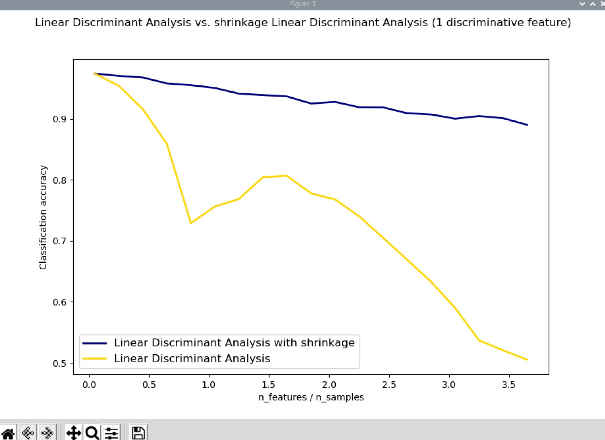  
### `plot_lda_qda.py` 
`cat` details:  
```
bird@humming:~/iot/lesson8 $ cat plot_lda_qda.py
"""
====================================================================
Linear and Quadratic Discriminant Analysis with confidence ellipsoid
====================================================================

Plot the confidence ellipsoids of each class and decision boundary
"""
print(__doc__)

from scipy import linalg
import numpy as np
import matplotlib.pyplot as plt
import matplotlib as mpl
from matplotlib import colors

from sklearn.discriminant_analysis import LinearDiscriminantAnalysis
from sklearn.discriminant_analysis import QuadraticDiscriminantAnalysis

###############################################################################
# colormap
cmap = colors.LinearSegmentedColormap(
    'red_blue_classes',
    {'red': [(0, 1, 1), (1, 0.7, 0.7)],
     'green': [(0, 0.7, 0.7), (1, 0.7, 0.7)],
     'blue': [(0, 0.7, 0.7), (1, 1, 1)]})
plt.cm.register_cmap(cmap=cmap)


###############################################################################
# generate datasets
def dataset_fixed_cov():
    '''Generate 2 Gaussians samples with the same covariance matrix'''
    n, dim = 300, 2
    np.random.seed(0)
    C = np.array([[0., -0.23], [0.83, .23]])
    X = np.r_[np.dot(np.random.randn(n, dim), C),
              np.dot(np.random.randn(n, dim), C) + np.array([1, 1])]
    y = np.hstack((np.zeros(n), np.ones(n)))
    return X, y


def dataset_cov():
    '''Generate 2 Gaussians samples with different covariance matrices'''
    n, dim = 300, 2
    np.random.seed(0)
    C = np.array([[0., -1.], [2.5, .7]]) * 2.
    X = np.r_[np.dot(np.random.randn(n, dim), C),
              np.dot(np.random.randn(n, dim), C.T) + np.array([1, 4])]
    y = np.hstack((np.zeros(n), np.ones(n)))
    return X, y


###############################################################################
# plot functions
def plot_data(lda, X, y, y_pred, fig_index):
    splot = plt.subplot(2, 2, fig_index)
    if fig_index == 1:
        plt.title('Linear Discriminant Analysis')
        plt.ylabel('Data with fixed covariance')
    elif fig_index == 2:
        plt.title('Quadratic Discriminant Analysis')
    elif fig_index == 3:
        plt.ylabel('Data with varying covariances')

    tp = (y == y_pred)  # True Positive
    tp0, tp1 = tp[y == 0], tp[y == 1]
    X0, X1 = X[y == 0], X[y == 1]
    X0_tp, X0_fp = X0[tp0], X0[~tp0]
    X1_tp, X1_fp = X1[tp1], X1[~tp1]

    alpha = 0.5

    # class 0: dots
    plt.plot(X0_tp[:, 0], X0_tp[:, 1], 'o', alpha=alpha,
             color='red')
    plt.plot(X0_fp[:, 0], X0_fp[:, 1], '*', alpha=alpha,
             color='#990000')  # dark red

    # class 1: dots
    plt.plot(X1_tp[:, 0], X1_tp[:, 1], 'o', alpha=alpha,
             color='blue')
    plt.plot(X1_fp[:, 0], X1_fp[:, 1], '*', alpha=alpha,
             color='#000099')  # dark blue

    # class 0 and 1 : areas
    nx, ny = 200, 100
    x_min, x_max = plt.xlim()
    y_min, y_max = plt.ylim()
    xx, yy = np.meshgrid(np.linspace(x_min, x_max, nx),
                         np.linspace(y_min, y_max, ny))
    Z = lda.predict_proba(np.c_[xx.ravel(), yy.ravel()])
    Z = Z[:, 1].reshape(xx.shape)
    plt.pcolormesh(xx, yy, Z, cmap='red_blue_classes',
                   norm=colors.Normalize(0., 1.))
    plt.contour(xx, yy, Z, [0.5], linewidths=2., colors='k')

    # means
    plt.plot(lda.means_[0][0], lda.means_[0][1],
             'o', color='black', markersize=10)
    plt.plot(lda.means_[1][0], lda.means_[1][1],
             'o', color='black', markersize=10)

    return splot


def plot_ellipse(splot, mean, cov, color):
    v, w = linalg.eigh(cov)
    u = w[0] / linalg.norm(w[0])
    angle = np.arctan(u[1] / u[0])
    angle = 180 * angle / np.pi  # convert to degrees
    # filled Gaussian at 2 standard deviation
    ell = mpl.patches.Ellipse(mean, 2 * v[0] ** 0.5, 2 * v[1] ** 0.5,
                              180 + angle, facecolor=color, edgecolor='yellow',
                              linewidth=2, zorder=2)
    ell.set_clip_box(splot.bbox)
    ell.set_alpha(0.5)
    splot.add_artist(ell)
    splot.set_xticks(())
    splot.set_yticks(())


def plot_lda_cov(lda, splot):
    plot_ellipse(splot, lda.means_[0], lda.covariance_, 'red')
    plot_ellipse(splot, lda.means_[1], lda.covariance_, 'blue')


def plot_qda_cov(qda, splot):
    plot_ellipse(splot, qda.means_[0], qda.covariance_[0], 'red')
    plot_ellipse(splot, qda.means_[1], qda.covariance_[1], 'blue')

###############################################################################
for i, (X, y) in enumerate([dataset_fixed_cov(), dataset_cov()]):
    # Linear Discriminant Analysis
    lda = LinearDiscriminantAnalysis(solver="svd", store_covariance=True)
    y_pred = lda.fit(X, y).predict(X)
    splot = plot_data(lda, X, y, y_pred, fig_index=2 * i + 1)
    plot_lda_cov(lda, splot)
    plt.axis('tight')

    # Quadratic Discriminant Analysis
    qda = QuadraticDiscriminantAnalysis(store_covariance=True)
    y_pred = qda.fit(X, y).predict(X)
    splot = plot_data(qda, X, y, y_pred, fig_index=2 * i + 2)
    plot_qda_cov(qda, splot)
    plt.axis('tight')
plt.suptitle('Linear Discriminant Analysis vs Quadratic Discriminant Analysis')
plt.show()
```  
Resulting plot:  
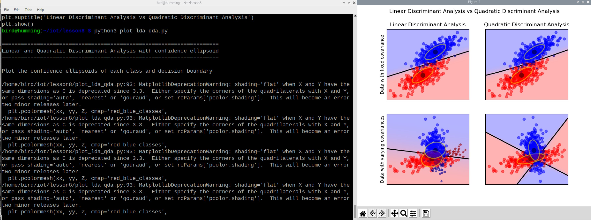

### `plot_cv_predict.py`  
`cat` details:  
```
bird@humming:~/iot/lesson8 $ cat plot_cv_predict.py
"""
====================================
Plotting Cross-Validated Predictions
====================================

This example shows how to use `cross_val_predict` to visualize prediction
errors.

"""
from sklearn import datasets
from sklearn.model_selection import cross_val_predict
from sklearn import linear_model
import matplotlib.pyplot as plt

lr = linear_model.LinearRegression()
boston = datasets.load_boston()
y = boston.target
print('Number of instances: %d' % (boston.data.shape[0]))

# cross_val_predict returns an array of the same size as `y` where each entry
# is a prediction obtained by cross validated:
predicted = cross_val_predict(lr, boston.data, y, cv=10)

fig, ax = plt.subplots()
ax.scatter(y, predicted)
ax.plot([y.min(), y.max()], [y.min(), y.max()], 'k-', lw=2)
ax.set_xlabel('Measured')
ax.set_ylabel('Predicted')
plt.show()
```
Reulting plot and output:  
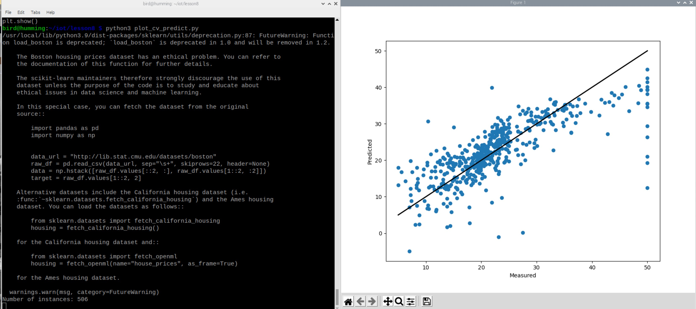  

### `plot_cv_diabetes.py`  
`cat`, output, and plot details:  
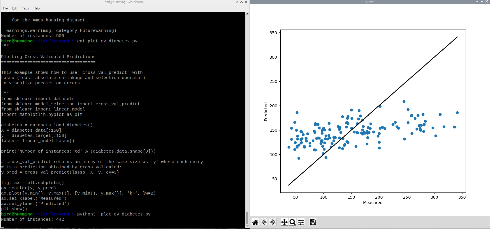   

### `traffic.py`
`cat` and output details:  
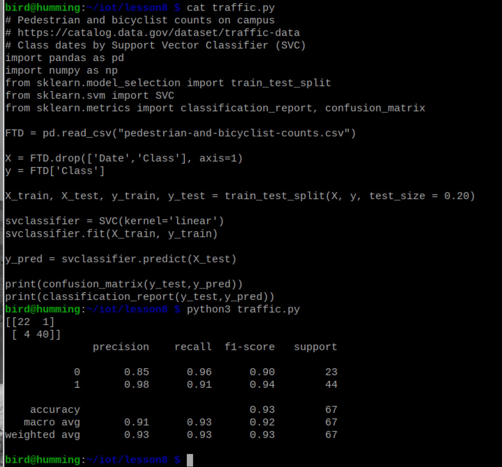  

### Keras and Tensorflow  
Unfortunately, despite following intructions [here]() for installing TensorFlow on Debian Bullseye as best as I could, I still ran into the following errors when trying to execute `keras_diabetes.py` and `keras_first_network.py`.
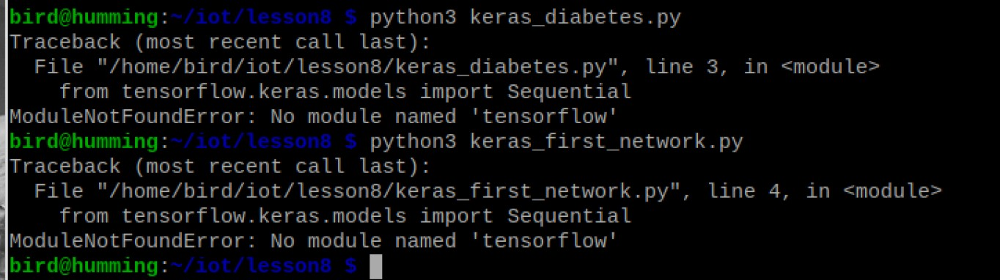  

### Titanic Exampls
`titanic_1.py`
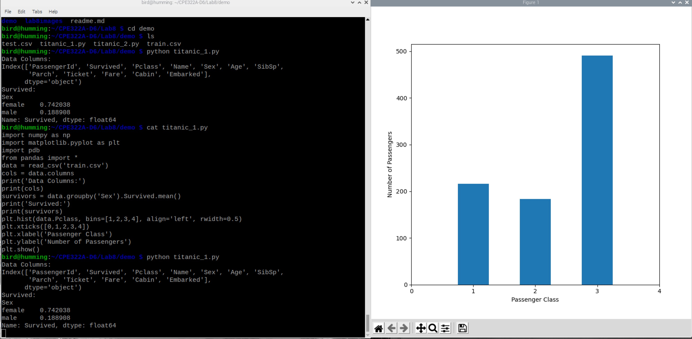  
`titanic_2.py`
`cat` details:  
```
bird@humming:~/CPE322A-D6/Lab8/demo $ cat titanic_2.py
import numpy as np
from pandas import *
options.mode.chained_assignment = None
data=read_csv('train.csv')
columns=data.columns
look_up=(data.groupby(['Sex', 'Pclass']).Survived.mean())
test=read_csv('test.csv')
test['Prediction']=0
for i in range(len(test)):
    test.Prediction[i]=round(look_up[test.Sex[i]][test.Pclass[i]])
test.to_csv('result.csv', index=False)
data['Fare_Bracket']=0
test['Fare_Bracket']=0
na=sum(test.Fare != test.Fare)
wh_badfare=np.flatnonzero(test.Fare != test.Fare)
sv = test.Fare[test.Fare != test.Fare]
test.Fare[test.Fare != test.Fare]=(3-test.Pclass)*11
test.Fare_Bracket=np.array([min(int(price/10),3) for price in test.Fare])
test.Fare[wh_badfare]=sv
data.Fare_Bracket=np.array([min(int(price/10),3) for price in data.Fare])
look_up2=(data.groupby(['Sex', 'Pclass', 'Fare_Bracket']).Survived.mean())
for i in range(len(test)):
    test.Prediction[i] = round(look_up2[test.Sex[i]][test.Pclass[i]][test.Fare_Bracket[i]])
test.to_csv('result2.csv', index=False)
print('Survived:')
print(look_up)
print('Number of Missing Fare: %d' % (na))
print('Indices of Missing Fare: %d' % (wh_badfare))
print('Survived:')
print(look_up2)
```  
Resulting Output:  
```
bird@humming:~/CPE322A-D6/Lab8/demo $ python titanic_2.py
Survived:
Sex     Pclass
female  1         0.968085
        2         0.921053
        3         0.500000
male    1         0.368852
        2         0.157407
        3         0.135447
Name: Survived, dtype: float64
Number of Missing Fare: 1
Indices of Missing Fare: 152
Survived:
Sex     Pclass  Fare_Bracket
female  1       2               0.833333
                3               0.977273
        2       1               0.914286
                2               0.900000
                3               1.000000
        3       0               0.593750
                1               0.581395
                2               0.333333
                3               0.125000
male    1       0               0.000000
                2               0.400000
                3               0.383721
        2       0               0.000000
                1               0.158730
                2               0.160000
                3               0.214286
        3       0               0.111538
                1               0.236842
                2               0.125000
                3               0.240000
Name: Survived, dtype: float64
```  
