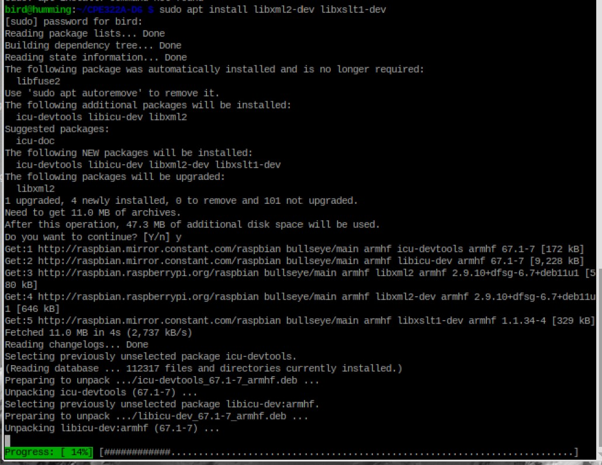
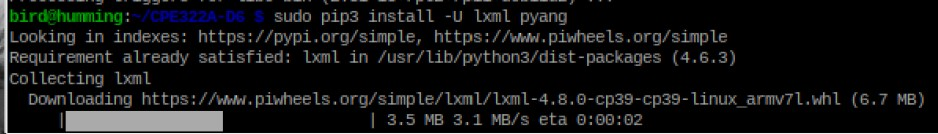
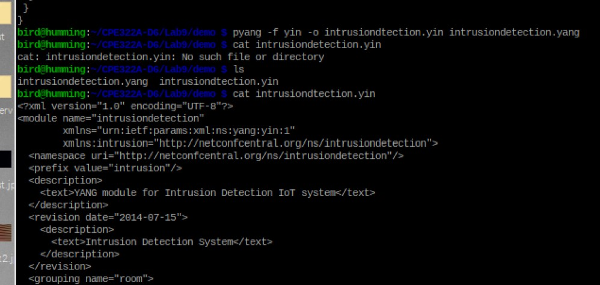
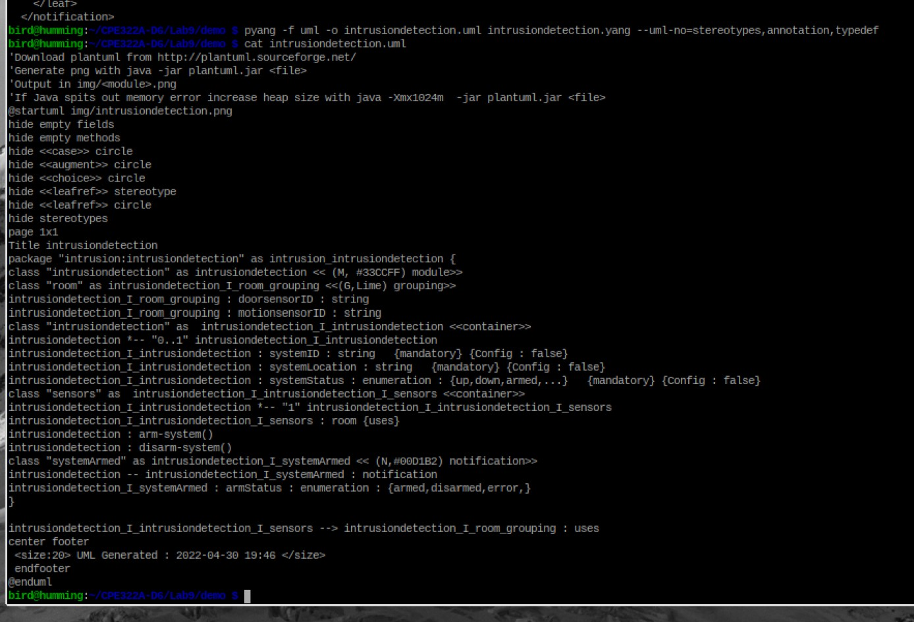
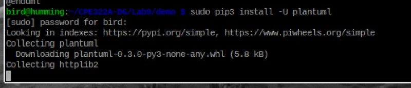
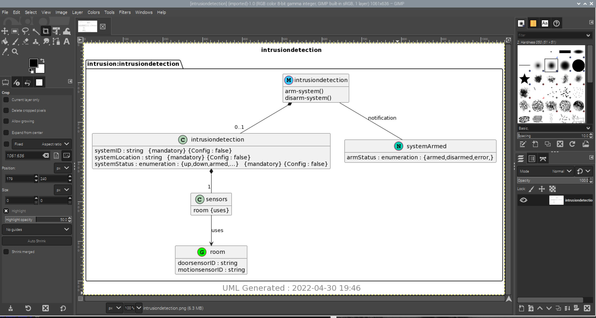

# Lab 9A: YANG

## Installing PYANG for Raspberry Pi use  
  
  

## `cat intrustiondetection.yang`  
  

## `cat intrusiondtection.yin`  
    

## `cat intrusiondetection.uml`  
  

## Installing PlantUML  
  

## Finalized UML File, PNG format, viewed in GIMP
  
