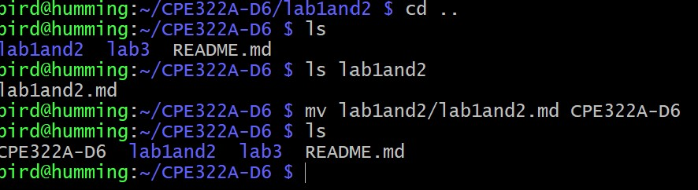

# LAB 1: Basic Linux Terminal commands.  

---
## $ hostname - name of device on network  

---
## $ git clone - clones git repository to whatver directory you're in  

---
## $ cd - moves you to root directory.
- $ cd [directory name] - moves you to named directory.  
- $ cd .. - moves you to parent directory. 
 

---
## $ ls - lists all files and folders in a directory.  

---
## $ ping localhost - pings your own machine.

---
## $ df - displays avilable disk space.

---
## $ ifconfig - displays ip, mac address, etc. 
I have not posted this because ifconfig can contain sensitive information that should not be on a public repository.
---
## $ mkdir [directory name] - creates a new folder/directory in the current directory. 

---
## $ uname - displays machine details.

---
## $ man [service] - displays manual for called service. Below is an example for the service "uname".

