# LAB 1: Basic Linux Terminal commands.  

## $ hostname - name of device on network  
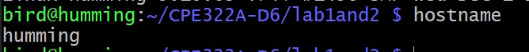  

## $ git clone - clones git repository to whatever directory you're in  
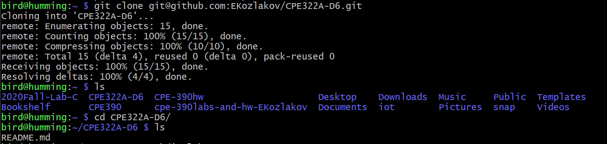  

## $ cd - moves you to root directory.
- $ cd [directory name] - moves you to named directory.  
- $ cd .. - moves you to parent directory. 
 
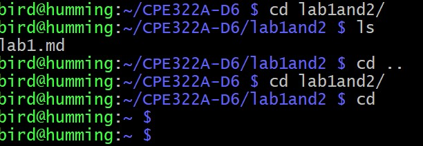  

## $ ls - lists all files and folders in a directory.  
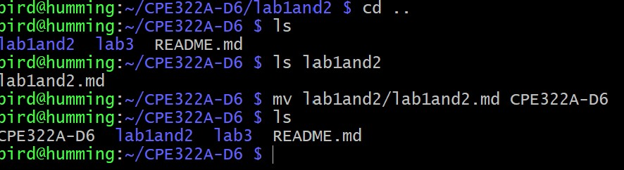  

## $ ping localhost - pings your own machine.
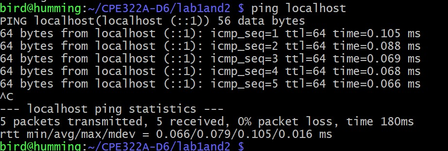  

## $ df - displays avilable disk space.  
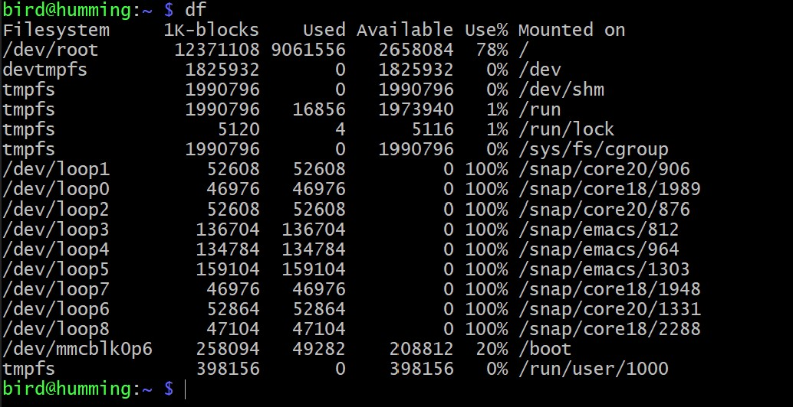  

## $ ifconfig - displays ip, mac address, etc. 
I have not posted this because ifconfig can contain sensitive information that should not be on a public repository.  

## $ mkdir [directory name] - creates a new folder/directory in the current directory. 
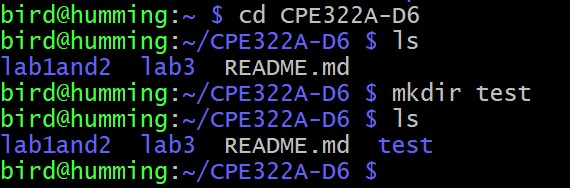  

## $ uname - displays machine details.
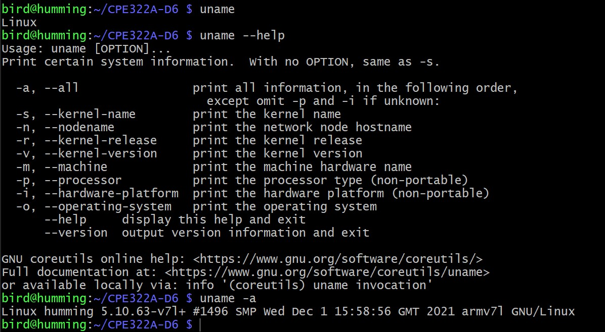  

## $ man [service] - displays manual for called service. Below is an example for the service "uname".
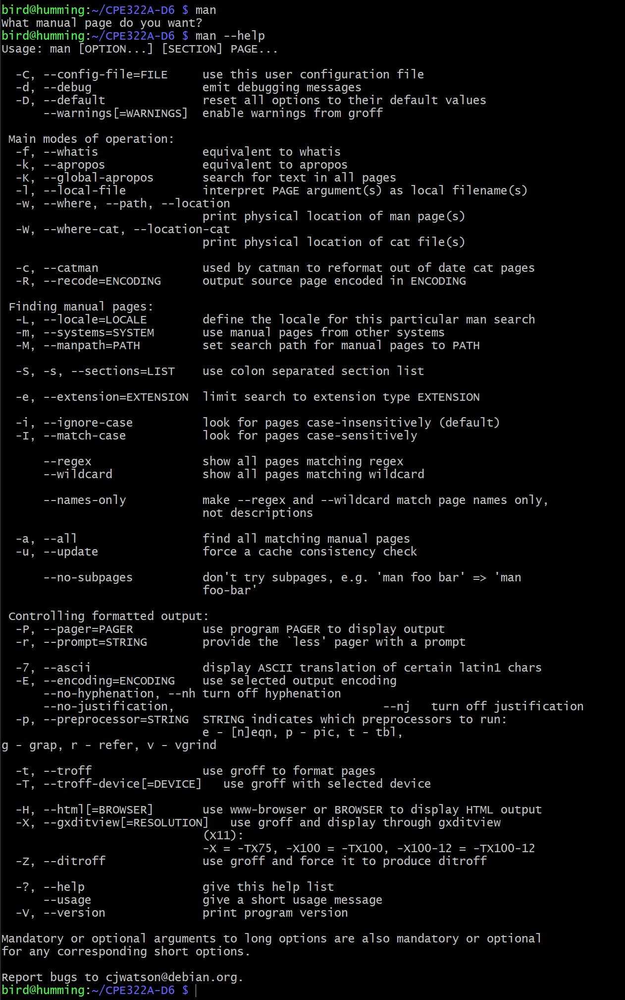  

---  
# LAB 2G and 2H: Audio and Image Recording  
## LAB 2H: Audio Recording 
For this section of the lab, I used a the microphone of a USB webcam as my acting microphone and a pair of ordinary earbuds for playback through the Raspberry Pi 4B's 3.5 mm audio jack. I used the "arecord" service to record audio and "aplay" service to play back the produced .wav files. Below are screenshots of the commands and the subsequent audio files.

I first checked if my Raspberry Pi registered any of my audio inputs and outputs by typing `arecord -l` in the commandline. This lists any recording devices available to the Pi in a simple format. In this case, my webcam was the available recording device, listed as such.  
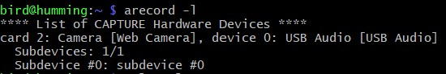  

I then checked if my Pi successfully registered my audio output (earbuds) by typing `aplay -l` in the commandline. Again, this is the same as `arecord -l` but for output devices.  
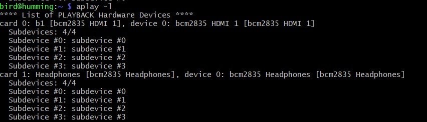  

Now that I knew my inputs and outputs were recognized, I started recording my audio files.

### "test.wav" - First Audio file
For this audio file, I simply typed `arecord test.wav` to get started. This is the simplest way to get started recording. By default, `arecord` records in Unsigned 8-bit, 8kHz sample rate in Mono audio.  
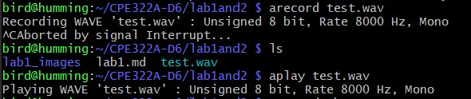  

Audio File: [test.wav](lab2files/test.wav)

### "test2.wav" - Second Audio file
For this audio file, I followed assignment parameters and typed the following in my commandline: 
`arecord --device=hw:2,0 --format S16_LE --rate 44100 -c1 test2.wav`. 
The breakdown is as follows: 
 - the `--device` flag specifies which device I'm using to record, in this case device 2; 
 - the `--format` flag indicates the file is being recorded in S16_LE format; 
 - the `--rate` flag indicates the sampling rate for the file, in this case it's 44.1 kHz (defaulted to 48 kHz);
 - and the `-c1` flag indicates the number of channels for the recording, in this case, 1 channel was used.  
  
The screenshots and resulting audio file are below.

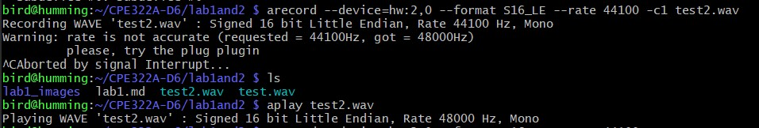  

Audio File: [test2.wav](lab2files/test2.wav) 

### "test6.wav" - 6th Audio file, First stereo audio file.  
I experimented with several more recordings in an attempt to get a stereo recording. I succeeded in my recording of "test6.wav", but I'm not sure if there is a noticable difference audibly. However, I am glad to have finally recorded *some* kind of stereo file. Below are screenshots of the final attempts before I succeeded, and a link to the audio file itself. 
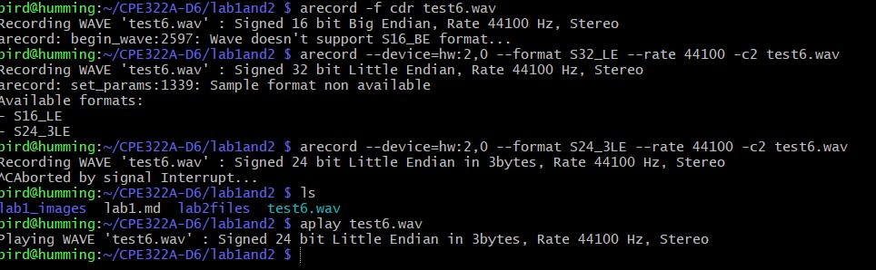  

Audio File: [test6.wav](lab2files/test6.wav)

### Endnote
Throughout my trials and errors I produced approximately 6 total audio files. I will put on the markdown the ones I have mentioned above, but the rest can be accessible in the back files.

---
## LAB 2H: Image Capture using a webcam 
Following the audio recording lab, I attempted to capture images using the same camera I used as a microphone. This was accomplished by installing fswebcam by way of the instructions on Professor Lu's IoT repository [here](https://github.com/kevinwlu/iot/tree/master/lesson2#connect-a-usb-webcam-to-raspberry-pi-install-fswebcam-and-save-images). Below are 5 images I took using the webcam, under different paramters.

### image1.jpg
Commandline entry: `fswebcam image.jpg`. Since resolution was not specified, it defaulted to 382x288. Below is the output: an image of my Raspberry Pi.  

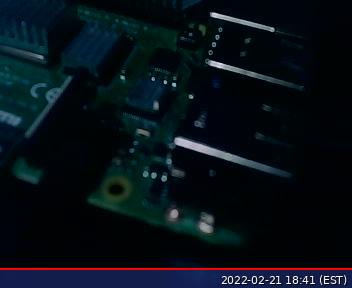

### image2.jpg
Commandline entry: `fswebcame -r 1280x720 image2.jpg`. `-r 1280x720` denotes resolution setting. In this case, resolution was set to 1280x720. Output below.  

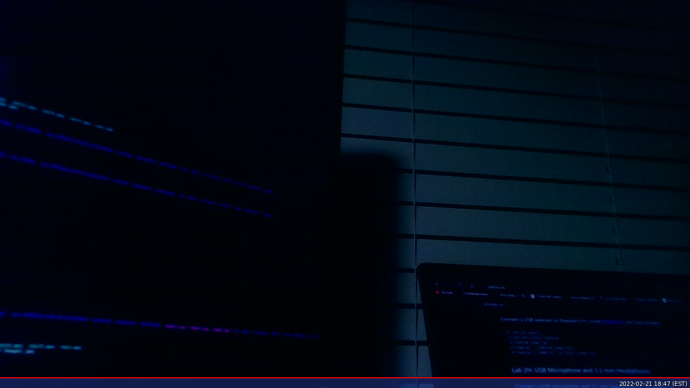

### image3.jpg
Commandline entry: `fswebcam -r 1280x720 --no-banner image3.jpg`. Same instruction as for image2, with the only difference being the `--no-banner` flag. This option removes the banner fswebcam automatically puts at the bottom of images, containing the timestamp of the image. It can contain other details by way of additional flags if desired. I have noticed that the image appears brighter without the flag. At the time of writing, I am not sure why this is.  

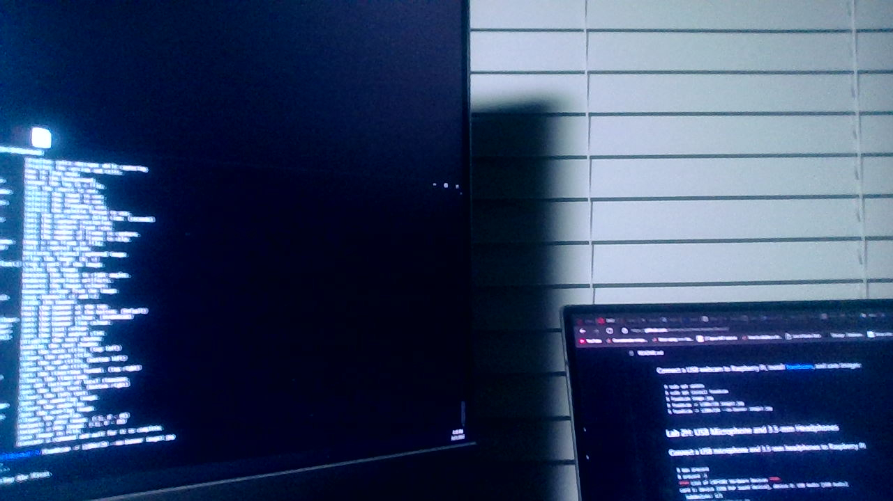

### Endnote(s)
1. I have noticed there is a blue tinge to every captured image from my webcam. At the time of writing, I am not sure why this is.  
2. I have taken several more images without the `--no-banner` flag which can be found in the "lab2files" folder of this particular directory. Feel free to take a look.

