# Lab 3A: Python Basics

## Numerical operations
Below is an example of some basic math functions python is capable of handling via the numpy library, as well how it can identify imaginary and real components of complex numbers.

- Variable assignment and description call  
  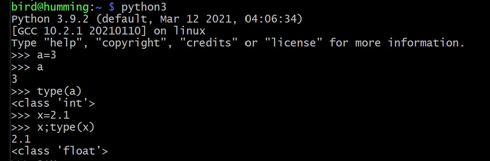  
  
- Arithmetic operations  
  - Note: Two asterisks `**` indicate a superscript. Below, the variable `a` (3) has been raised to the power of 2, yielding 9.  
  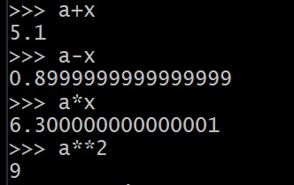  

- Complex number descriptions: Below a complex number with an imaginary compenent `2+3j` is set equal to the variable `y`. The following calls serve to identify the real and complex components of this number.  
  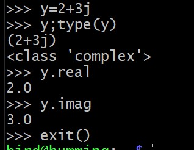  

## Strings and binary data
The terminal images below show how simple string manipulations can be accomplished in python.  

 - Variable assignment, case manipulation (`.upper()` and `.lower()`), and character removal (`strip()`). All changes made were temporary and displayed immediately.  
    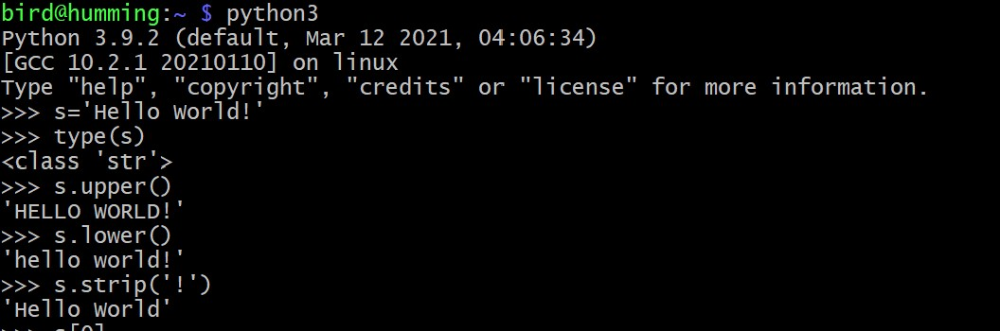  
    
 - Displaying specifics characters and length count. `s[0]` calls for the first character in string variable, `s[6:]` calls for every character starting from the 6th position in the string variable, and `s[6:-1]` calls for every character between the 6th position and the length-1 position (in this case, since the string length is 12, the last character retrieved would be the 11th character.  
    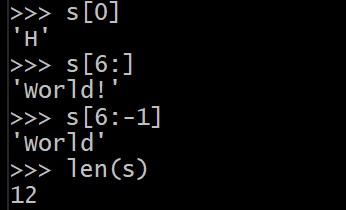 
    
 - Binary Encoding and Decoding of strings.  
    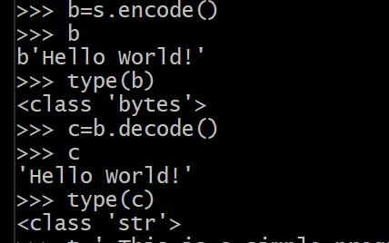
    
 - Concatenation and `print()` formatting.  
    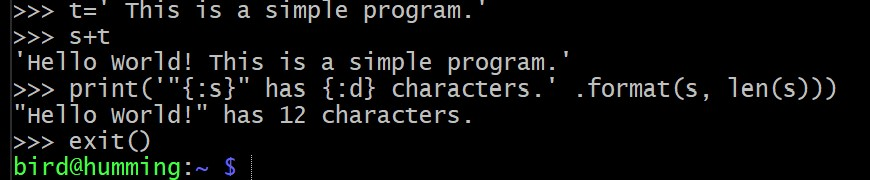

## Tuples
Tuples listing examples.
  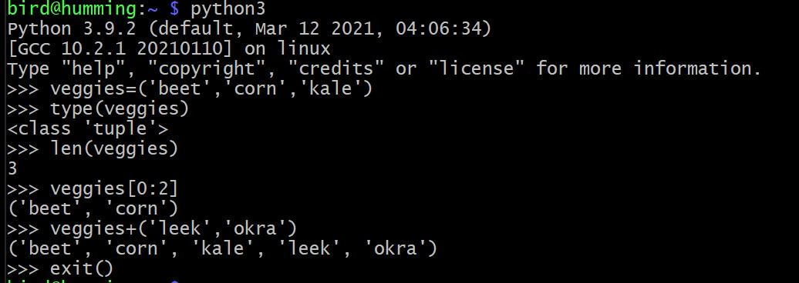

## Lists  
List manipulation with python.  
    
  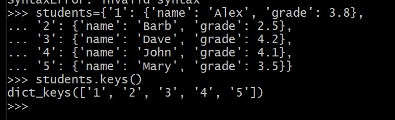  

## If-else statement  
  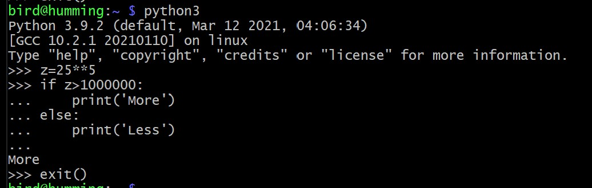  
  
## If-not statement
  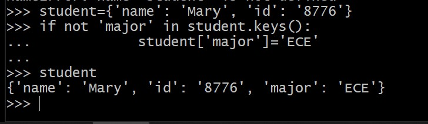  

## For-loop statements
  Several examples utilizing previously made strings, lists, and dictionaries.
    

## While-loop statements
  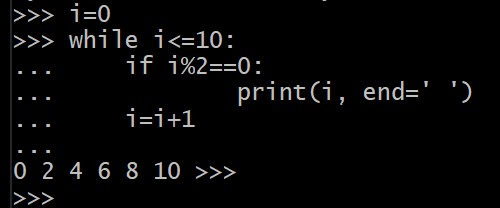

## Break statement
  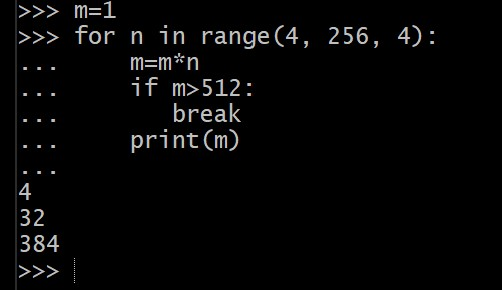

## Continue statement
  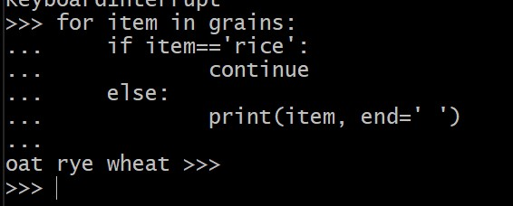  
  
## More Math
  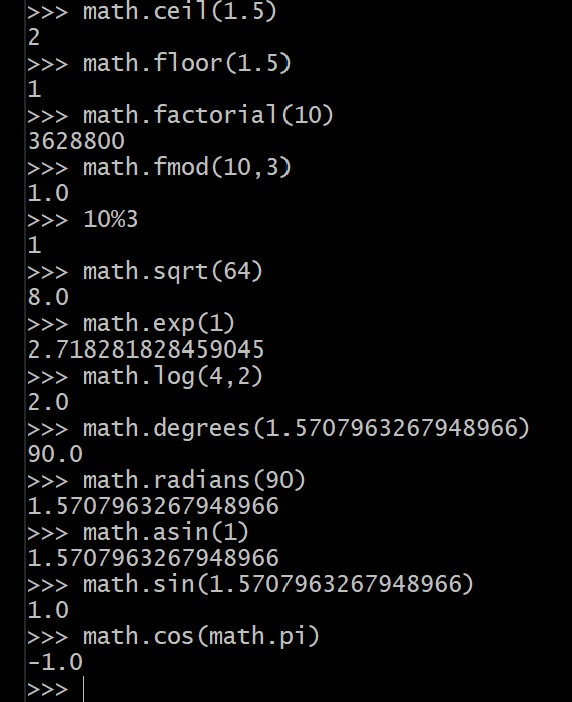
  
## Range function
  Usage `range([start],[stop],[step])`  
  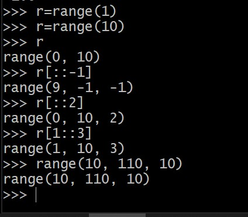
  
## Defining a few functions.
  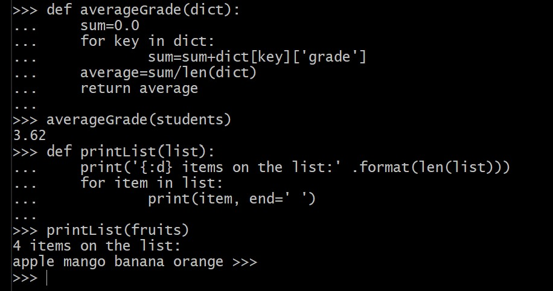  

## Keyword args
   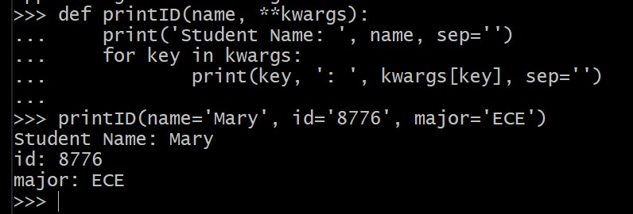
   
## Variable Length Arguments
   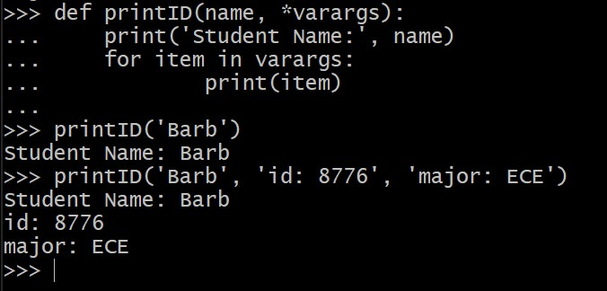

## Using some modules
   

## File read-write
  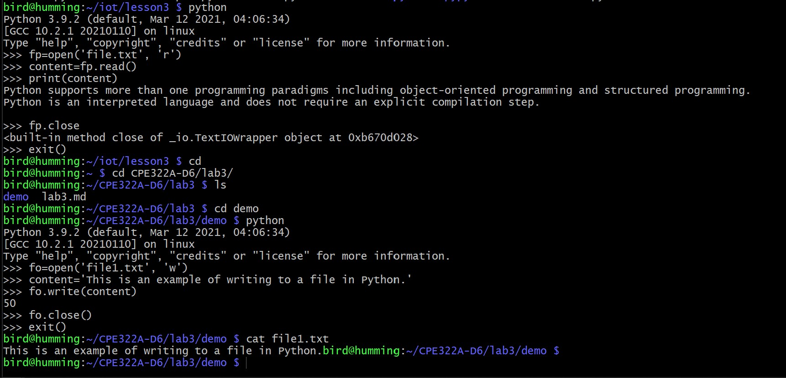

## Running some prewritten programs  
### 2example.py (corrected)
  Needed to add a few parentheses around the `print` statement, and change `raw_input()` to `input()`.  
  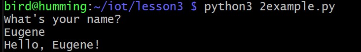
  
### julian.py
  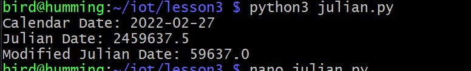
  
### sun.py - New York, Beijing, and Moscow
  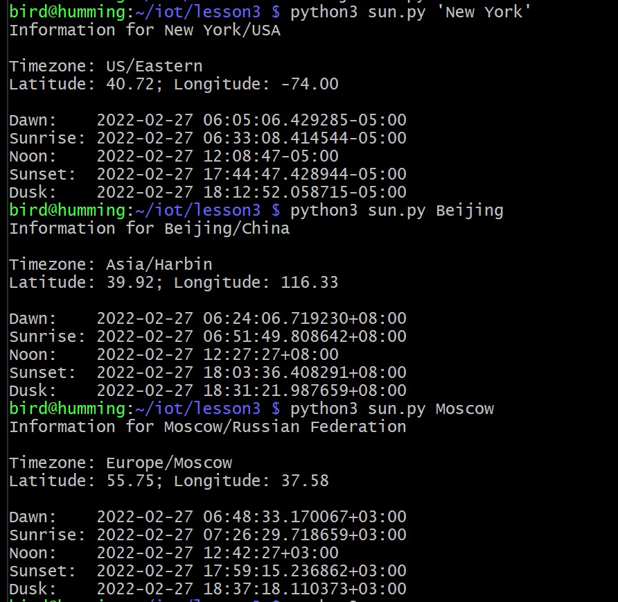
  
### moon.py
  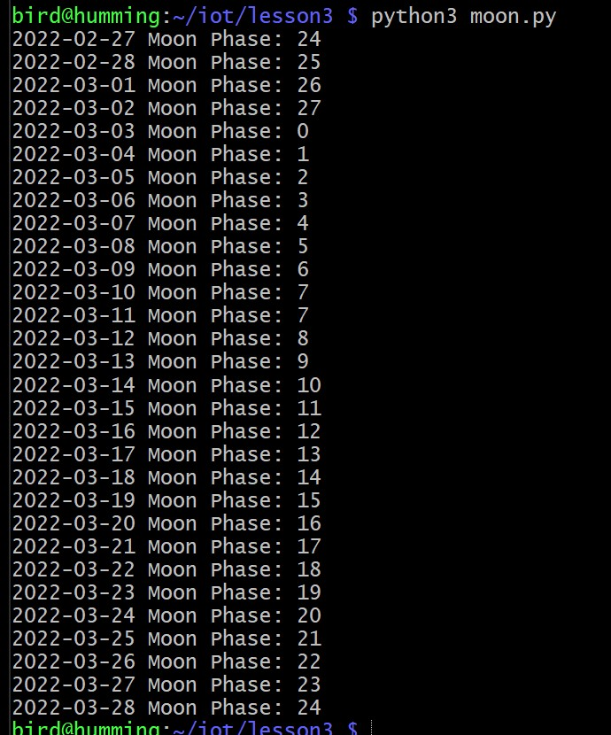
  
### coordinates.py
  Tried a few things here and there with it.  
  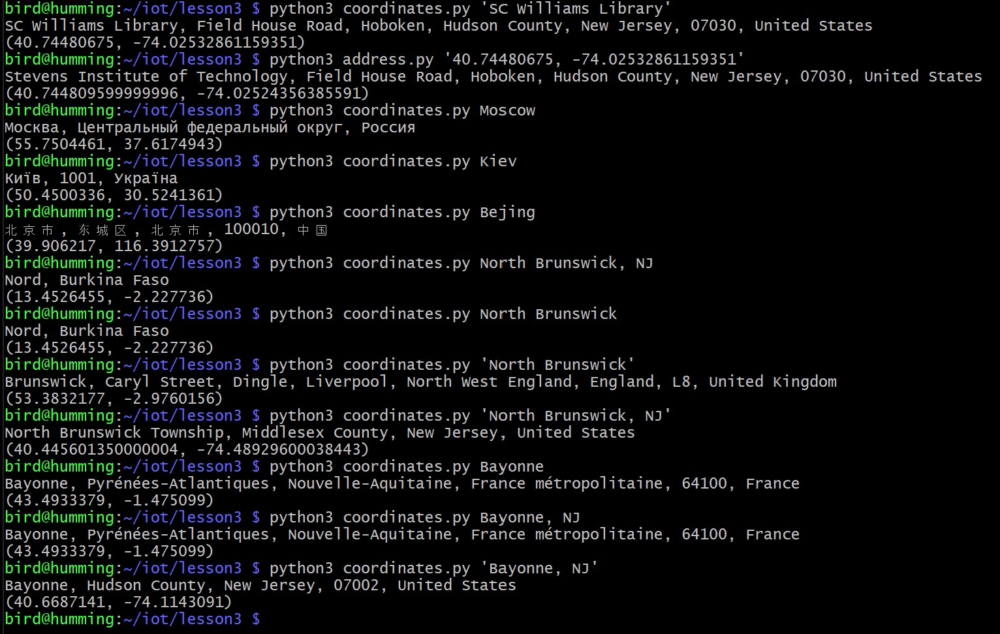
  
### cpu.py
  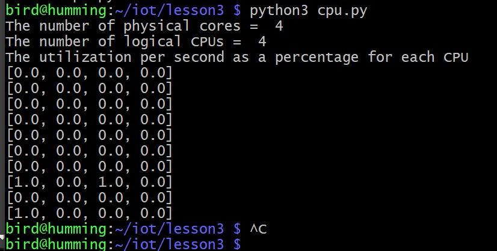
  
### system_info.py
  For some reason, there was a fialure to read my cpu stats.
  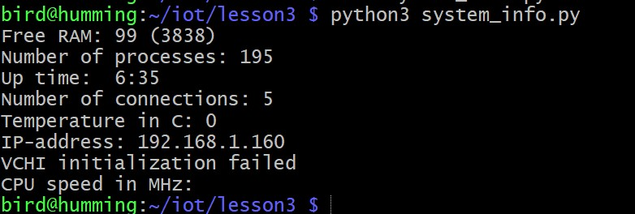
  
### socket server magic
  Left : Socket Server. Right : Socket Client.  
  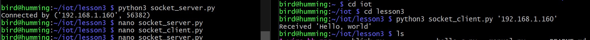
