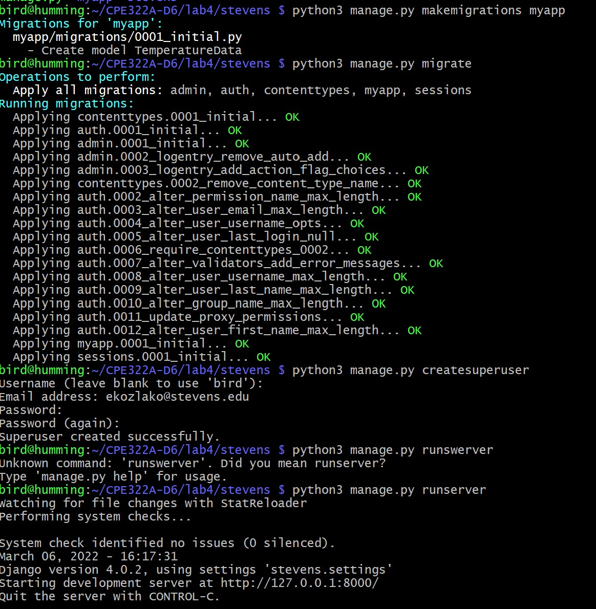
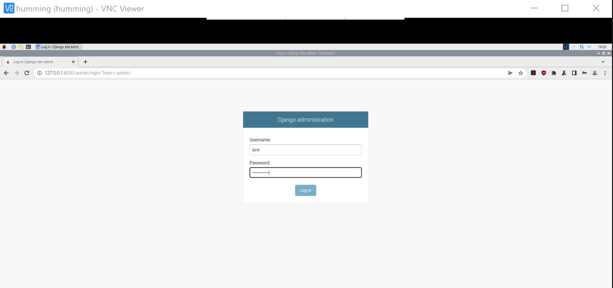
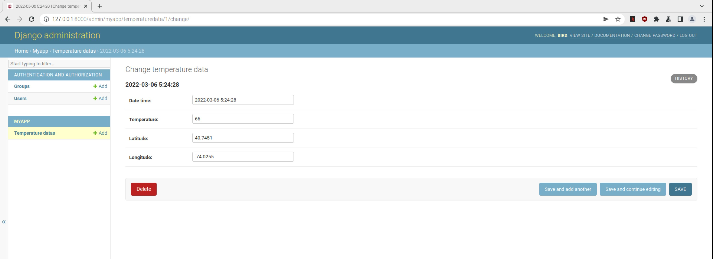
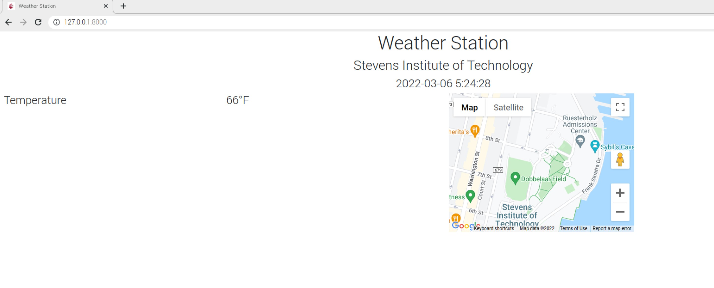
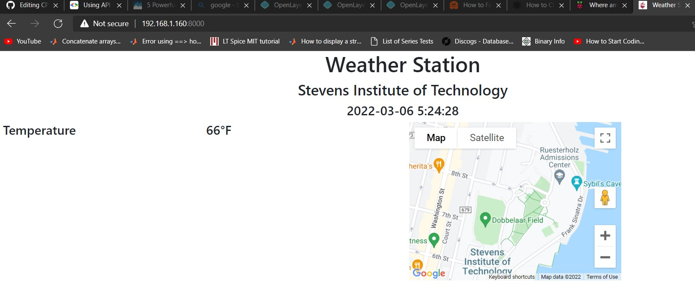
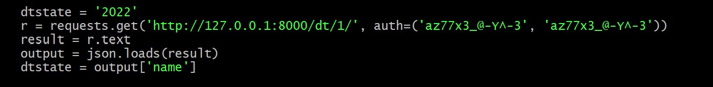

# Lab 4: Django, Django REST, and Flask.  

## Django Server Setup and Running 

### 'Stevens' Django Project   
I followed the instructions for setting up a Database through MariaDB/MySQL from Dr.Kevin Lu's [IoT Lesson 4 Repository](https://github.com/kevinwlu/iot/tree/master/lesson4/stevens) for the ["stevens"](https://github.com/kevinwlu/iot/tree/master/lesson4/stevens) project.  

Afterwards, I created a superuser after migrating the model for "Temperature Data." The terminal during this process is shown below.  
  

Following launch, I logged into the Django Administration page for this site by going to the localhost address, http://127.0.0.1:8000/admin, and logging in with the superuser credentials I created earlier. To clarify, I did this on my Raspberry Pi through VNC viewer.  
  

Next, I hit "Add" under temperature datas and filled out the static information for date, time, temperature, and coordinates of the Stevens Institute of Technology. The coordinates are input so that the Google Maps API can display the desired location.  
  

Below is the resulting website. I am wondering if there is a way to make the temperature, date, and time data update live, as well as display multiple locations and maps at once. I will see if I can look into this into the coming weeks.  
  

Following the instrcutions, I then edited the `ALLOWED_HOSTS = []` argument in settings.py (on Line 28)  to `ALLOWED_HOSTS = ['*']`, which would allow me to access this website/server from outside of the raspberry pi. Below is the view of the site from my browser.  
  

### 'MyCPU' Django REST Project

To be updated. Currently encountering issue where cpu, memory, and date time data cannot be retrieved due to an error online 31 of `views.py` file. However, Django REST server and other components seems to launc hand operate fine.  
Offending line is screenshotted below.  

### Flask  
Will be completed once 'MyCPU' is completed and reported on.
