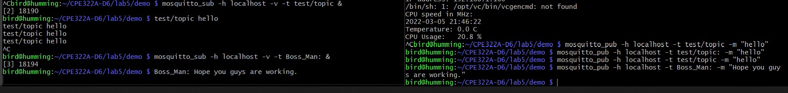
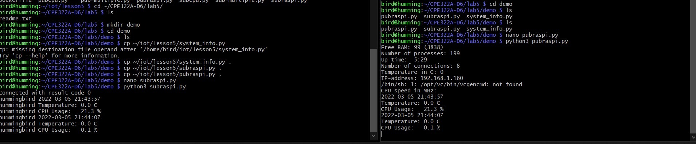

# Lab 5: Paho and Mosquitto Terminal Publishing and Subscription.
Paho and Mosquitto are two service that allow for information publication and subscription on different or even different computers. Below I will demonstrate how I set up and utilized both of these.  

## Setup  
Setting up is very simple. I followed the instructions on Dr. Kevin Lu's Lesson 5 repository to install both apps [here](https://github.com/kevinwlu/iot/tree/master/lesson5).  
I have also included the linux terminal commands for installation from Dr. Lu's repo below, in case you didn't want to rifle throught it.  

### Mosquitto installation  
`$ sudo apt install mosquitto mosquitto-clients`  

### Paho installation  
Here the instructions call for cloning the eclipse paho repo for some additional finagling with pub/sub functions.  

```
$ sudo pip3 install -U paho-mqtt
$ git clone https://github.com/eclipse/paho.mqtt.python.git
```  

## Functions  
After installation, I followed further instructions to publish from one terminal on my laptop to another, while remoted into my Raspberry Pi `bird@humming`.  
Unfortunately since I don't have another PC on hand, I could only user terminals.  

### Mosquitto pub/sub tests  
Below is a screenshot of me testing out some pub/sub functionality between two terminals using Mosquitto. I am publishing on the right terminal, and the left terminal is subscribed to the right.  
Note: Through inference, it seems like the `-t` flag sets the title for the topic, before the actual message/payload to be sent. First the topics were "test/topic", and then I changed it to "Boss Man" for fun.  

  

### Paho pub/sub system info tests  
After playing around with Mosquitto, I ran some of the scripts written in the eclipse paho repo. Below is a screenshot of my screwing around on two terminals, publishing system info about my raspberry pi from the right terminal to the left.  

  
